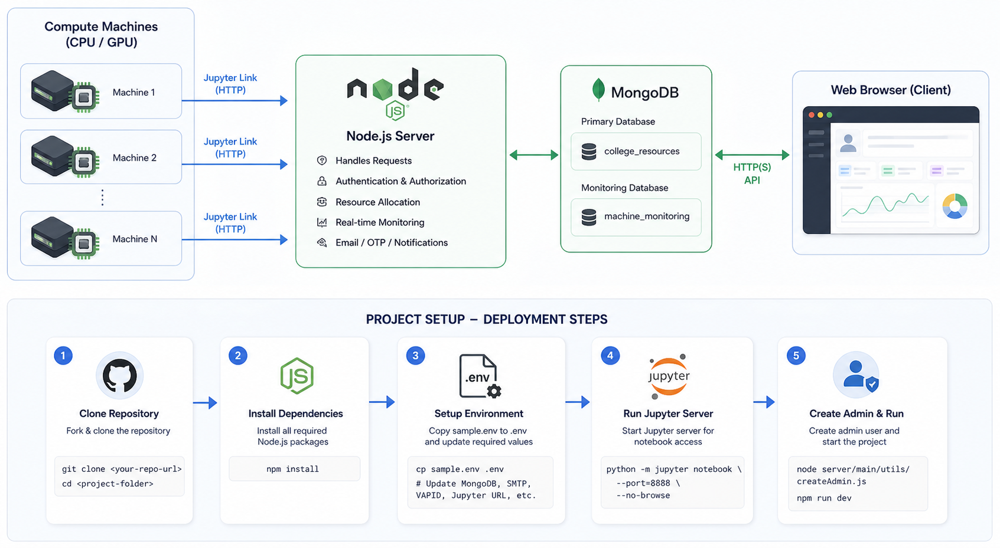

# Resource Management System - For GPU/CPU

> Development Setup Guide (Post-Deployment Compatible)


## Introduction

This project is an open-source resource management system designed to help organizations efficiently host, allocate, and monitor their CPU and GPU infrastructure. It enables institutions to bring their compute resources online, manage user access, and maintain full visibility over usage—without relying on expensive proprietary software.

The system is particularly suited for educational institutions, research labs, and R&D organizations that require a cost-effective, flexible, and scalable solution to manage shared compute environments.

## Features

### 👥 Role-Based Access System

The platform implements a structured, role-based access model to ensure proper governance, security, and efficient workflow management:

- **Admin**
  - Full control over the system and configurations
  - Manage users, machines, and permissions
  - Monitor system-wide activity

- **Teachers / Supervisors**
  - Review and validate student requests
  - Approve or reject access based on academic or research needs

- **Students / Users**
  - Request access to CPU/GPU resources
  - Track request status and usage

---

### 📝 Request & Approval Workflow

A transparent and structured lifecycle for resource requests:

- Students submit requests specifying:
  - Required resources (CPU/GPU)
  - Duration of usage
  - Purpose of request

- Teachers:
  - Review requests for relevance and necessity
  - Approve or reject accordingly

- Approved requests proceed for allocation

This workflow ensures responsible and efficient utilization of shared resources.

---

### 🖥️ Machine Management

Centralized management of all compute resources:

- Add new CPU/GPU machines with detailed specifications
- Remove or decommission outdated or faulty machines
- Maintain a live and updated inventory of all resources
- Support onboarding of **any number of machines**

---

### 📊 Monitoring & Administrative Control

Comprehensive control and visibility for administrators:

- Monitor real-time machine usage and utilization
- Track active users and their allocations
- Modify or revoke user access when required
- Ensure optimal and fair distribution of resources

---

### 📈 Usage Reports & Insights

Enable data-driven decisions with detailed analytics:

- Generate reports on CPU/GPU usage
- Analyze trends in resource demand
- Share reports with faculty or management
- Support infrastructure planning and scaling

---

### ⏱️ Availability Check System

Improve efficiency and avoid resource conflicts:

- Check real-time availability of machines before requesting access
- Prevent overbooking and contention
- Help users plan workloads effectively

---

### 🔄 Scalable Infrastructure

Designed to grow with your needs:

- Supports **unlimited machine integration**
- Suitable for small labs to large institutional clusters
- Easily adaptable to increasing workloads and users

---

# 🚀 Project Setup Guide

## 🗺️ System Architecture



> _Compute machines connect via Jupyter HTTP links to the Node.js server, which manages auth, resources, and notifications. MongoDB handles persistence across two databases, and clients communicate via HTTP(S) API._

---

## 📋 Table of Contents

- [Prerequisites](#-prerequisites)
- [1. Fork & Clone](#-1-fork--clone-repository)
- [2. Install Dependencies](#-2-install-dependencies)
- [3. Environment Variables](#-3-environment-variables-setup)
- [4. Jupyter Server](#-4-setup-jupyter-server)
- [5. Create Admin](#-5-create-admin)
- [6. Create Test Users](#-6-create-test-users)
- [7. Run the Project](#-7-run-the-project)
- [Verification Checklist](#-verification-checklist)
- [Important Notes](#-important-notes)

---

## 📌 Prerequisites

Ensure the following are installed before proceeding:

| Tool        | Version           | Purpose                  |
| ----------- | ----------------- | ------------------------ |
| **Node.js** | v16 or higher     | Runtime environment      |
| **npm**     | Bundled with Node | Package manager          |
| **MongoDB** | Local instance    | Primary database         |
| **Python**  | 3.x               | Jupyter Notebook backend |
| **Git**     | Latest stable     | Version control          |

---

## 🍴 1. Fork & Clone Repository

### Step 1 — Fork

Go to the original repository on GitHub and click **Fork** to copy it to your account.

### Step 2 — Clone & Enter Directory

```bash
git clone <your-forked-repo-url>
cd <project-folder>
```

---

## 📦 2. Install Dependencies

```bash
npm install
```

---

## ⚙️ 3. Environment Variables Setup

This project uses a `.env` file for all sensitive configuration.

### Create the file

```bash
cp sample.env .env
```

Then open `.env` and fill in each section below.

---

### 🗄️ MongoDB

```env
MONGO_URI=mongodb://localhost:27017/college_resources
STATS_DB_URI=mongodb://localhost:27017/machine_monitoring
```

---

### 🔔 Web Push (VAPID Keys)

Generate your keys first:

```bash
npx web-push generate-vapid-keys
```

Then paste the output into `.env`:

```env
VAPID_PUBLIC_KEY=your_public_key
VAPID_PRIVATE_KEY=your_private_key
```

---

### 📧 SMTP (Gmail)

```env
SMTP_HOST=smtp.gmail.com
SMTP_PORT=587
SMTP_USER=your_email@gmail.com
SMTP_PASS=your_app_password
```

> 💡 Use a [Gmail App Password](https://myaccount.google.com/apppasswords) — not your regular Gmail password.

---

### 📓 Jupyter Server

```env
JUPYTER_SERVER_URL=your_jupyter_server_url
```

> ⚠️ Only update the required values above. Leave all other variables unchanged.

---

## 🧠 4. Setup Jupyter Server

### Install JupyterLab

```bash
pip install jupyterlab
```

### Start the server

#### 🍎 macOS / Linux

```bash
python -m jupyter notebook \
  --ip=0.0.0.0 \
  --port=8888 \
  --NotebookApp.base_url='/notebook' \
  --NotebookApp.token='your-token' \
  --NotebookApp.password='' \
  --NotebookApp.allow_origin='*' \
  --no-browse
```

#### 🪟 Windows

```bash
python -m jupyter notebook --ip=0.0.0.0 --port=8888 --NotebookApp.base_url='/notebook' --NotebookApp.token='your-token' --NotebookApp.password='' --NotebookApp.allow_origin='*' --no-browse
```

### Access Jupyter in the browser

Once the server is running, open your browser and navigate to:

```
http://localhost:8888
```

When prompted for a token, paste the following:

```
382ac7ebf58c8fc0ac8d5a26c534e61bbe49681cb359b7e9bcb36b346e18f336
```

> 💡 The token is pre-configured in the start command above. You only need to paste it once — the session stays authenticated until the server is restarted.

---

## 🛠️ 5. Create Admin

```bash
cd server/main/utils
node createAdmin.js
```

This creates an admin user in the database.

---

## 👨‍🎓 6. Create Test Users

Manually create the following accounts for testing system functionality:

- **Teacher** — for testing teacher-facing features
- **Student** — for testing student-facing features

---

## ▶️ 7. Run the Project

> ⚠️ Ensure MongoDB is running before this step.

```bash
npm run dev
```

---

## ✅ Verification Checklist

Use this checklist to confirm everything is working after setup:

- [ ] MongoDB connected and running
- [ ] Dev server started without errors
- [ ] Admin user created successfully
- [ ] Teacher & Student test accounts working
- [ ] SMTP configured and sending emails
- [ ] OTP generating correctly
- [ ] VAPID / Web Push keys active
- [ ] Jupyter server connected and responding

---

## ⚠️ Important Notes

```
🚫  Do NOT commit your .env file to version control
🔐  Keep all credentials and API keys private
🍃  Always ensure MongoDB is running before starting the server
```

---

## 🧑‍💻 Setup Summary

This project is initialized by following these steps in order:

1. Fork & clone the repository
2. Run `npm install`
3. Copy `sample.env` → `.env` and fill in all required values
4. Generate VAPID keys and add to `.env`
5. Configure SMTP (Gmail App Password)
6. Start the Jupyter server
7. Run `node createAdmin.js` to create admin
8. Create dummy Teacher & Student users
9. Verify OTP system is functional
10. Run `npm run dev` and check the verification list above

---

> 🎯 **Project is fully set up and ready for development.**

---

<p align="center">
  <i>Crafted with ❤️ in Chandigarh, India</i><br>
  Telecommunication Research Laboratory · Menthosa Solutions Pvt. Ltd.
</p>
